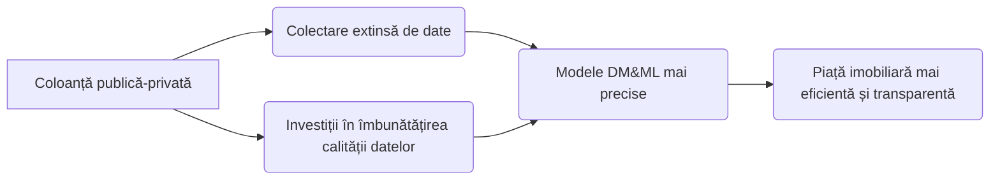
```mermaid
graph LR
A[Coloanță publică-privată] --> B(Colectare extinsă de date)
A --> C(Investiții în îmbunătățirea calității datelor)
B & C --> D(Modele DM&ML mai precise)
D --> E(Piață imobiliară mai eficientă și transparentă)

```
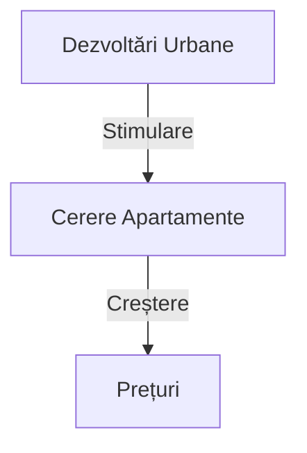
```mermaid
graph TD;
    A[Dezvoltări Urbane] -->|Stimulare| B[Cerere Apartamente];
    B -->|Creștere| C[Prețuri];

```
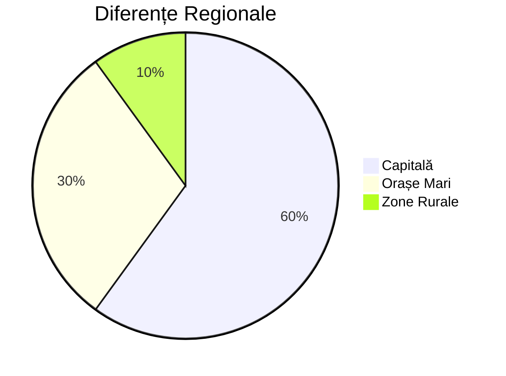
```mermaid
pie title Diferențe Regionale
    "Capitală" : 60
    "Orașe Mari" : 30
    "Zone Rurale" : 10

```

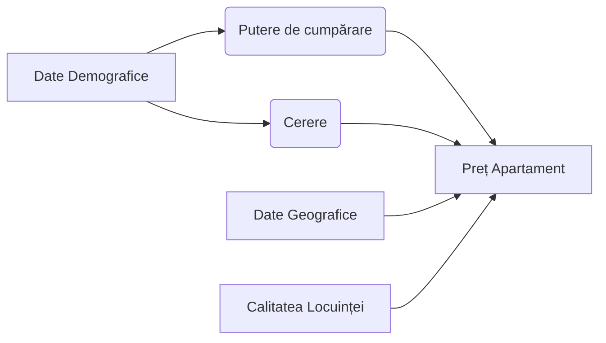
```mermaid

graph LR
A[Date Demografice] --> B(Cerere)
A --> C(Putere de cumpărare)
C --> D[Preț Apartament]
B --> D
E[Date Geografice] --> D
F[Calitatea Locuinței] --> D


```

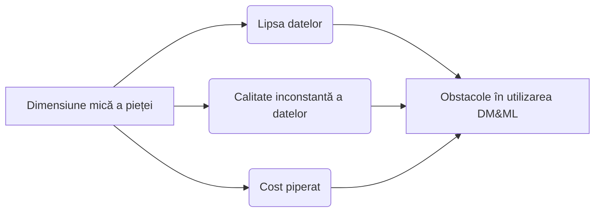
```mermaid
graph LR
A[Dimensiune mică a pieței] --> B(Lipsa datelor)
A --> C(Calitate inconstantă a datelor)
A --> D(Cost piperat)
B --> E(Precizie redusă)
C --> E
D --> E
E[Obstacole în utilizarea DM&ML]
```

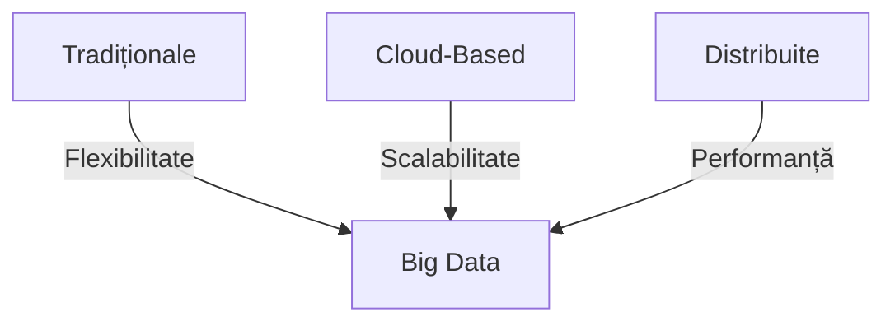
```mermaid
graph TD;
    A[Tradiționale] -->|Flexibilitate| C[Big Data];
    B[Cloud-Based] -->|Scalabilitate| C;
    D[Distribuite] -->|Performanță| C;

```

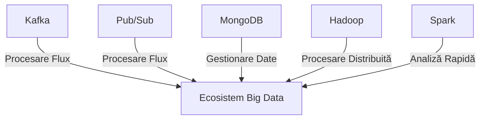
```mermaid
graph TD;
    A[Kafka] -->|Procesare Flux| C[Ecosistem Big Data];
    F[Pub/Sub] -->|Procesare Flux| C[Ecosistem Big Data];
    B[MongoDB] -->|Gestionare Date| C;
    D[Hadoop] -->|Procesare Distribuită| C;
    E[Spark] -->|Analiză Rapidă| C;

```
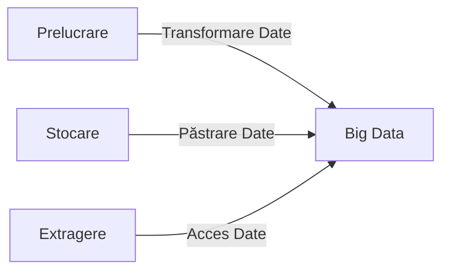
```mermaid
graph LR;
    A[Prelucrare] -->|Transformare Date| C[Big Data];
    B[Stocare] -->|Păstrare Date| C;
    D[Extragere] -->|Acces Date| C;
```

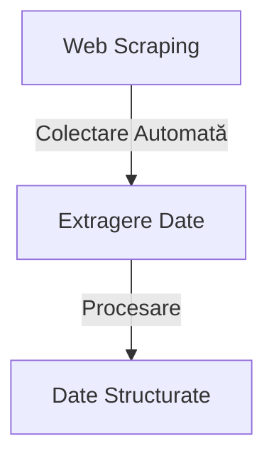
```mermaid
graph TD;
    A[Web Scraping] -->|Colectare Automată| B[Extragere Date];
    B -->|Procesare| C[Date Structurate];
```

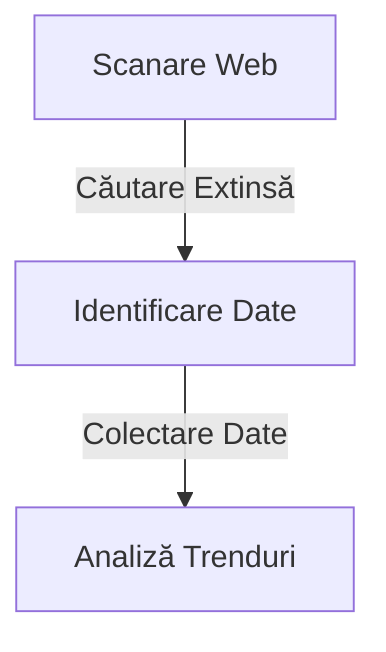
```mermaid
graph TD;
    A[Scanare Web] -->|Căutare Extinsă| B[Identificare Date];
    B -->|Colectare Date| C[Analiză Trenduri];

```

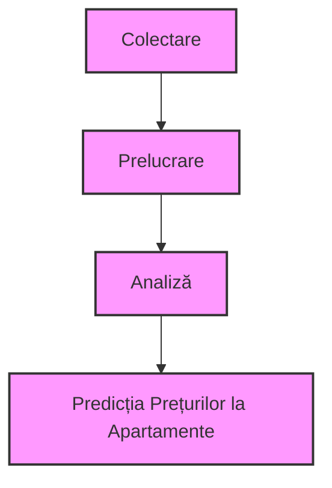
```mermaid
graph TD;
    Colectare --> Prelucrare;
    Prelucrare --> Analiză;
    Analiză --> Predicții[Predicția Prețurilor la Apartamente];
    
    classDef default fill:#f9f,stroke:#333,stroke-width:2px;
    class Predicții default;
```

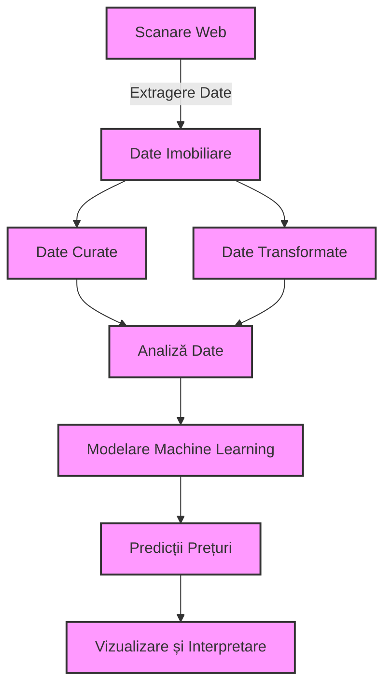
```mermaid
graph TD;
    CW[Scanare Web] -->|Extragere Date| DI[Date Imobiliare]
    DI --> DC[Date Curate]
    DI --> DT[Date Transformate]
    DC --> AD[Analiză Date]
    DT --> AD
    AD --> MML[Modelare Machine Learning]
    MML --> PP[Predicții Prețuri]
    PP --> VI[Vizualizare și Interpretare]

    classDef default fill:#f9f,stroke:#333,stroke-width:2px;
    class CW,DI,DC,DT,AD,MML,PP,VI default;
```

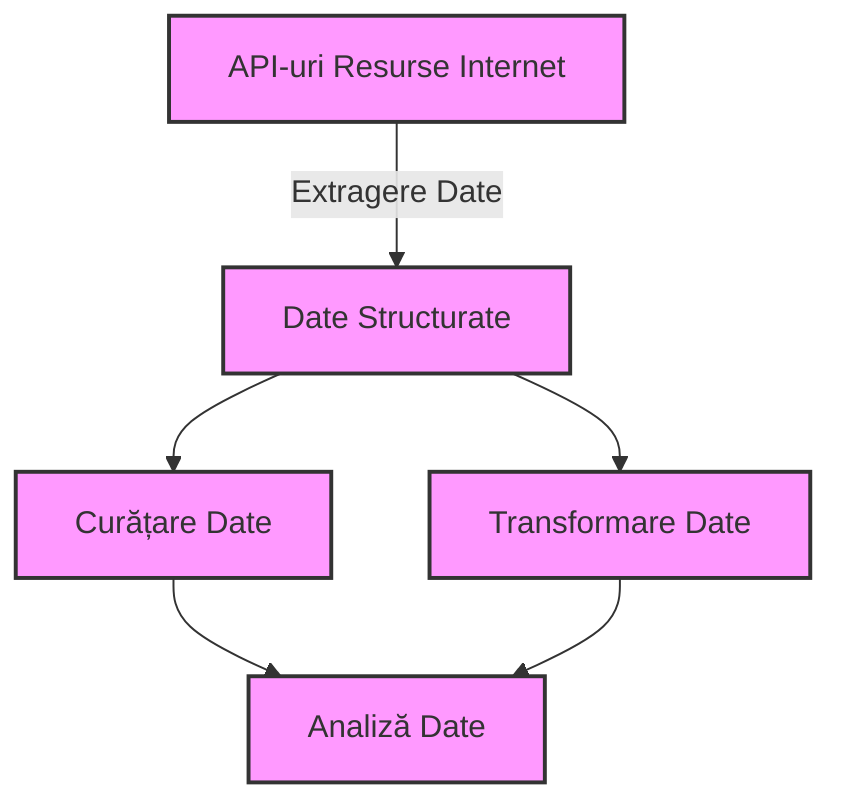
```mermaid
graph TD;
    API[API-uri Resurse Internet] -->|Extragere Date| D[Date Structurate]
    D --> C[Curățare Date]
    D --> T[Transformare Date]
    C --> A[Analiză Date]
    T --> A
   
    classDef default fill:#f9f,stroke:#333,stroke-width:2px;
    class API,D,C,T,A,ML,P,V default;
```